# Two-Timescale Reciprocity Simulation

This project simulates the interaction between two timescales in the evolution of cooperation:

1. **Fast timescale: learning within a lifetime**
2. **Slow timescale: evolutionary selection between generations**

The model is designed to show how learned reciprocal behavior can interact with evolved predispositions.

In simple terms:

```text
behavior now = evolved predisposition + learned social experience
```

The simulation uses a repeated social interaction game inspired by the Prisoner's Dilemma / donation game.

Agents can cooperate or defect. Cooperation costs the actor something but gives a larger benefit to the other agent. Over repeated interactions, agents learn which partners are trustworthy. Across generations, agents with higher total payoff reproduce more successfully.

---

## Three models in rising complexity

The project contains three simulation scripts, each adding one layer of social complexity on top of the previous:

| # | Script | Learning mechanism | Extra social features |
|---|---|---|---|
| 1 | `two_timescale_reciprocity.py` | Simple trust update (Rescorla–Wagner style) | — |
| 2 | `two_timescale_q_learning.py` | Q-learning (action-value estimates) | — |
| 3 | `two_timescale_extended.py` | Q-learning | Reputation, partner choice, forgiveness |

**Model 1 — Trust learning** is the baseline. Agents update a scalar trust value for each partner after every interaction and act on it. It is the simplest possible form of learned reciprocity.

**Model 2 — Q-learning** replaces the trust update with a proper reinforcement-learning rule. Agents maintain separate value estimates for cooperating and defecting with each partner, and choose the action with the higher expected return. This gives agents a more principled learning algorithm.

**Model 3 — Extended** keeps Q-learning but adds three mechanisms that make social life richer: agents can observe a partner's *reputation* (how others rate them), they can *choose* to avoid low-reputation partners, and they have a *forgiveness* parameter that lets them recover trust after a defection rather than permanently writing a partner off.

A fourth script, `experiment_network_diversity.py`, runs all three models across a range of network conditions to compare how each one handles more or less repeated interaction with strangers.

All three models share the same ring-network topology — see [Appendix: The ring network](#appendix-the-ring-network) for a description of the spatial structure and why it was chosen over a grid or torus.

---

## Contents

1. [Three models in rising complexity](#three-models-in-rising-complexity)
2. [Model 1 — Trust learning](#model-1--trust-learning)
   - [Inherited traits](#inherited-traits)
   - [The core decision rule](#the-core-decision-rule)
   - [Payoff structure](#payoff-structure)
   - [Why compare one-shot and repeated interaction?](#why-compare-one-shot-and-repeated-interaction)
   - [Output](#output)
   - [How to run](#how-to-run)
   - [Relation to cooperation mechanisms](#relation-to-cooperation-mechanisms)
   - [Mechanisms not yet included](#mechanisms-not-yet-included)
   - [Summary](#summary)
   - [Simulation results](#simulation-results)
3. [Model 2 — Q-learning](#model-2--q-learning)
4. [Model 3 — Extended (reputation + partner choice + forgiveness)](#model-3--extended-reputation--partner-choice--forgiveness)
5. [Network diversity experiment](#experiment-does-reputation-dominate-in-larger-more-diverse-networks)
6. [Appendix: Simple trust learning vs Q-learning](#appendix-simple-trust-learning-vs-q-learning)
7. [Appendix: Ecological realism of benefit > cost](#appendix-ecological-realism-of-benefit--cost)
8. [Appendix: The ring network](#appendix-the-ring-network)

---

## Model 1 — Trust learning

This section describes the baseline model (`two_timescale_reciprocity.py`). The two-timescale structure below applies to all three models, but the specific learning mechanism and inherited traits are unique to Model 1.

The model separates two processes:

### 1. Learning during a lifetime

During one generation, agents interact many times with local neighbors.

Each agent keeps a learned trust value for each partner:

```python
learned_trust[i, j]
```

This means:

```text
what agent i has learned about agent j during this lifetime
```

If partner `j` cooperates, agent `i` becomes more trusting of `j`.

If partner `j` defects, agent `i` becomes less trusting of `j`.

This is the fast, developmental, or "nurture" layer.

---

### 2. Evolution between generations

At the end of each generation, agents reproduce based on their lifetime payoff.

Agents with higher payoff are more likely to become parents.

Their offspring inherit three traits:

```python
trust_prior
learning_rate
responsiveness
```

These inherited traits are then slightly mutated.

This is the slow, evolutionary, or "nature" layer.

---

### Inherited traits

> These three traits are specific to **Model 1** (`two_timescale_reciprocity.py`). Model 2 evolves four different Q-learning parameters; Model 3 evolves those four plus three social parameters. See the [Model 2](#model-2--q-learning) and [Model 3](#model-3--extended-reputation--partner-choice--forgiveness) sections for details.

Each agent has three inherited traits.

#### `trust_prior`

The agent's initial tendency to cooperate with an unknown partner.

A high value means the agent starts out more trusting.

A low or negative value means the agent starts out more suspicious.

---

#### `learning_rate`

How quickly the agent updates trust after experience.

A high learning rate means the agent quickly changes its opinion of a partner.

A low learning rate means the agent changes slowly.

---

#### `responsiveness`

How strongly learned trust affects future behavior.

A high responsiveness means the agent strongly adjusts its cooperation based on past experience.

A low responsiveness means the agent mostly ignores learned trust.

---

### The core decision rule

The most important line in the model is:

```python
score_i = genes["trust_prior"][i] + genes["responsiveness"][i] * learned_trust[i, j]
```

This means:

```text
agent i's decision = inherited trust tendency + learned trust in partner j
```

Then the agent cooperates when:

```python
cooperate_i = score_i > 0.0
```

So an agent's behavior is not purely genetic and not purely learned.

It is the result of both.

---

### Payoff structure

The model uses a donation-game version of the Prisoner's Dilemma.

If agent `i` cooperates with agent `j`:

```text
agent i pays a cost
agent j receives a benefit
```

In the default script:

```python
benefit = 3.0
cost = 1.0
```

So cooperation is socially beneficial, because the recipient gains more than the actor loses.

However, cooperation can still be individually risky, because a defector can receive benefits without paying costs.

> **Why is benefit > cost?** The assumption that a single cooperative act benefits the recipient more than it costs the actor is a deliberate abstraction — not an ecological free lunch. See [Appendix: Ecological realism of benefit > cost](#appendix-ecological-realism-of-benefit--cost) for the justification and limitations.

---

### Why compare one-shot and repeated interaction?

The script runs two scenarios.

#### Scenario 1: Mostly one-shot interaction

```python
lifetime_rounds = 1
```

Agents barely have time to learn who is trustworthy.

Direct reciprocity has little chance to develop.

This usually makes cooperation harder to maintain.

---

#### Scenario 2: Repeated interaction

```python
lifetime_rounds = 80
```

Agents repeatedly meet neighbors.

They can learn who cooperates and who defects.

This allows direct reciprocity to matter.

Selection can then favor inherited traits that make reciprocal cooperation work better.

---

---

### Output

The script prints summary statistics such as:

```text
Final cooperation
Final payoff
Final trust prior
Final learning rate
Final responsiveness
```

It also saves plots in the `output/` folder:

```text
output/one_shot_cooperation.png
output/one_shot_traits.png
output/repeated_cooperation.png
output/repeated_traits.png
```

The most important plot is the cooperation plot.

It shows whether cooperation increases, collapses, or remains unstable over generations.

---

### How to run

Activate the project conda environment:

```bash
conda activate .conda
```

To create the environment from scratch:

```bash
conda create --prefix .conda python=3.11
conda activate .conda
conda install numpy matplotlib
```

Run each model individually:

```bash
# Trust-learning model (basic reciprocity + evolution)
python two_timescale_reciprocity.py

# Q-learning model (action-value learning + evolution)
python two_timescale_q_learning.py

# Extended model (Q-learning + reputation + partner choice + forgiveness)
python two_timescale_extended.py

# Network diversity experiment (all three models across stranger-fraction levels)
python experiment_network_diversity.py

# Network diversity experiment without live windows (headless)
python experiment_network_diversity.py --no-live-grid
```

In live mode, two windows update in real time: a payoff heatmap across
models/conditions and a per-generation cooperation plot for the current
stranger-fraction condition.

Live mode also includes a micro-level encounter matrix window. Each row i,
column j cell shows agent i's most recent action toward partner j in the
currently displayed round: green means cooperate (+1), red means defect (-1),
and dark cells indicate no encounter in that sampled round.

Each script saves plots to the `output/` folder.

---

### Relation to cooperation mechanisms

This model mainly includes two cooperation mechanisms:

#### Direct reciprocity

Agents condition behavior on previous interactions with the same partner.

In the script, this is represented by:

```python
learned_trust[i, j]
```

---

#### Network reciprocity

Agents interact repeatedly with local neighbors instead of random strangers.

In the trust-learning model (`two_timescale_reciprocity.py`), each agent has **8 ring neighbours** by default (`neighbors_per_agent = 8`):

```python
make_ring_neighbors(n, k)   # k = neighbors_per_agent (default 8)
```

In the Q-learning and extended models, each agent has **2 ring neighbours** (left and right only):

```python
make_ring_neighbors(num_agents)   # always 2 neighbours
```

The network diversity experiment (`experiment_network_diversity.py`) further varies how often agents encounter strangers outside their ring via `stranger_fraction`.

---

### Mechanisms not yet included

The current model does not yet include:

#### Kin selection

Agents do not know who their relatives are.

To add this, give agents family IDs and add extra cooperation tendency toward kin.

---

#### Indirect reciprocity

Agents do not observe reputation.

To add this, create public reputation scores that increase when agents cooperate and decrease when they defect.

---

#### Group selection

Groups do not reproduce or die as units.

To add this, divide agents into groups and allow high-performing groups to contribute more offspring to the next generation.

---

### Summary

This model demonstrates a mutual process between evolution and learning.

The fast process is:

```text
agents learn which partners cooperate
```

The slow process is:

```text
selection favors inherited traits that make successful learning and cooperation more likely
```

The model is not full Q-learning.

It is a simpler trust-learning model designed to show the interaction between:

```text
nature: evolved predispositions
nurture: learned social experience
behavior: cooperation or defection
selection: reproductive success
```

---

### Simulation results

The results below come from a single run with default parameters (120 generations, 100 agents, ring topology, `benefit=3.0`, `cost=1.0`).

#### Final statistics

| Metric | One-shot (`rounds=1`) | Repeated (`rounds=80`) |
|---|---|---|
| Final cooperation | 0.000 | 0.979 |
| Final payoff | 0.000 | 313.300 |
| Final trust prior | −0.864 | 1.447 |
| Final learning rate | 0.095 | 0.186 |
| Final responsiveness | 1.126 | 2.459 |

---

#### One-shot interaction

Without repeated contact agents cannot learn who cooperates, so reciprocity never gets off the ground.

**Cooperation collapses to zero.**

Evolution responds by driving `trust_prior` negative (−0.86): selection favors innate suspicion because unconditional cooperators are exploited. `responsiveness` stays moderate but is effectively irrelevant when there is nothing useful to learn in a single round.

<p align="center">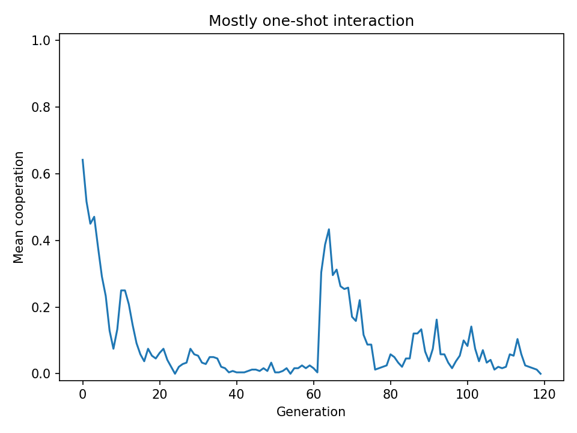</p>

<p align="center">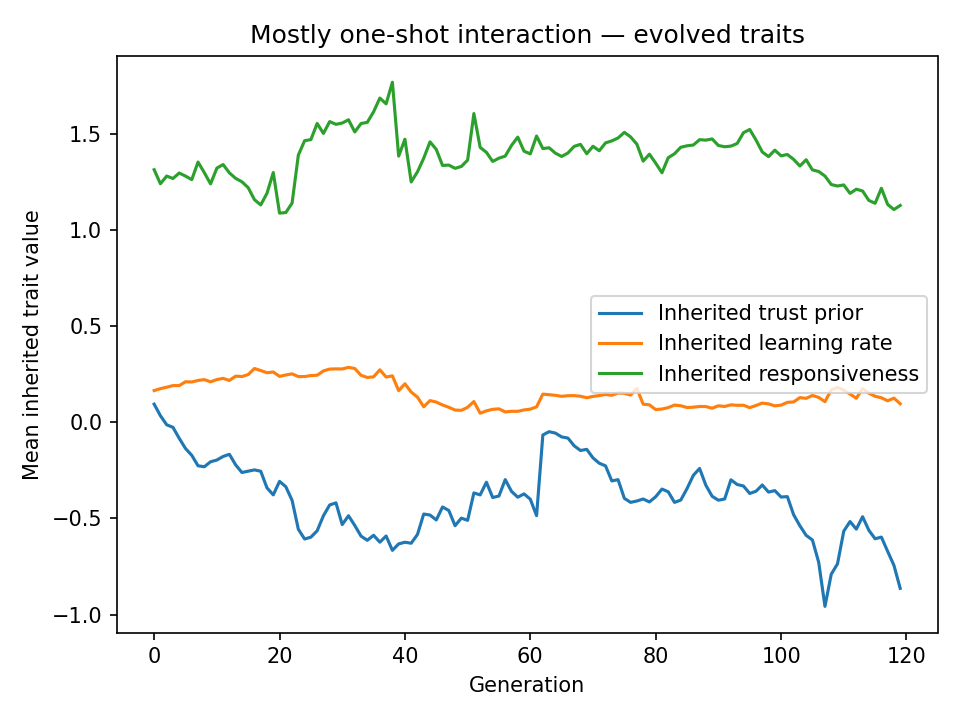</p>

---

#### Repeated interaction

With 80 rounds per generation, cooperation stabilizes near full (~98%).

**The trait trajectories explain the mechanism:**

- `trust_prior` rises to ~1.45 — selection favors agents who start out cooperative, because unconditional cooperators can seed mutual cooperation with neighbors.
- `responsiveness` rises strongly to ~2.46 — agents who amplify what they have learned become sharply conditional: they strongly reward cooperators and punish defectors, reinforcing the reciprocal equilibrium.
- `learning_rate` stays low (~0.19) in both scenarios — fast forgetting is not favored because stable trust relationships are valuable.

The dip around generation 45–55 is a classic invasion event: a defector lineage briefly spreads, trust collapses, and cooperation crashes. The population recovers because reciprocators with high `responsiveness` re-establish cooperation faster than defectors can spread.

<p align="center">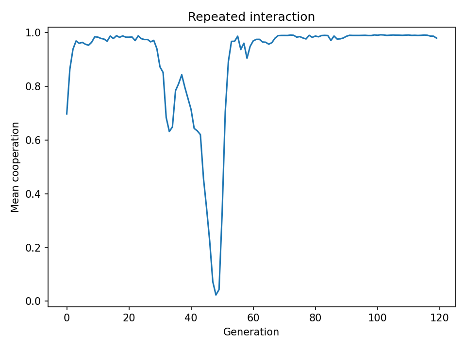</p>

<p align="center">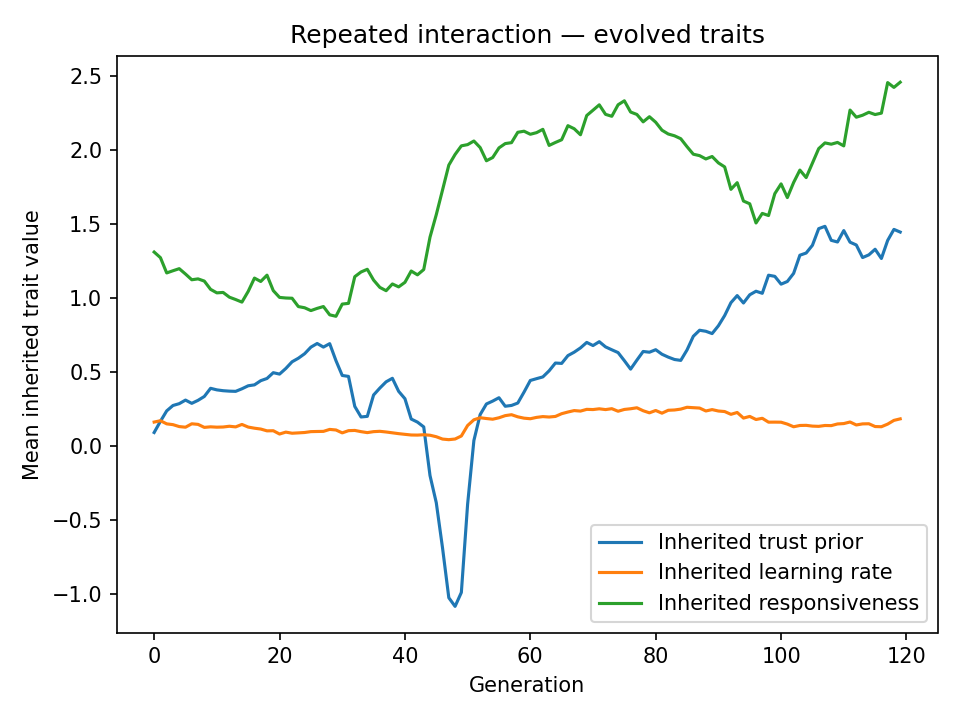</p>

---

#### Core message

The two timescales reinforce each other in the repeated case.

Learning makes cooperation individually rational *within* a lifetime.

Evolution then favors the inherited traits (`trust_prior`, `responsiveness`) that make that learning work most effectively.

In the one-shot case, the fast timescale provides no useful signal, so evolution strips away cooperative predispositions entirely.

---

## Model 2 — Q-learning

A second model (`two_timescale_q_learning.py`) replaces the simple trust scalar with **true Q-learning**. The two-timescale structure is the same as Model 1 — fast learning within a lifetime, slow evolution between generations — but the learning mechanism is more principled.

### 1. Learning during a lifetime

Instead of a single trust value, each agent keeps two **Q-values** per partner: one for cooperating with them and one for defecting.

```python
Q[i, j, COOPERATE]   # expected payoff if i cooperates with j
Q[i, j, DEFECT]      # expected payoff if i defects against j
```

After each interaction the agent updates the Q-value for the action it took:

```text
new Q = old Q + α × (reward + γ × max future Q  −  old Q)
```

The key addition over Model 1 is the **discount factor γ**: agents value the long-term relationship, not just the current round. An agent that cooperates now expects future cooperation to follow, so it "prices in" the future value of a good relationship.

Action selection uses **ε-greedy** exploration: with probability ε the agent tries a random action, otherwise it picks whichever action has the higher Q-value for that partner.

### 2. Evolution between generations

Agents with higher lifetime payoff reproduce more. Their offspring inherit four evolved Q-learning parameters, then slightly mutate:

```python
exploration_rate   # ε — how often to try random actions
learning_rate      # α — step size for Q-value updates
discount_factor    # γ — weight on future rewards
initial_q_bias     # starting optimism/pessimism about unknown partners
```

### Q-Learning results

These results use the corrected model where:
- Actions are chosen **simultaneously** (both agents decide before seeing the other's move)
- Rewards include **both cost paid and benefit received** in the same round
- `next_max_q` is the agent's current best Q-value for the **same partner**, so the discount factor genuinely bootstraps the long-term value of the relationship

| Metric | One-shot | Repeated |
|---|---|---|
| Final cooperation | 0.445 | 0.560 |
| Final payoff | 8.150 | 611.350 |
| Final exploration rate | 0.581 | 0.109 |
| Final learning rate | 0.353 | 0.180 |
| Final discount factor | 0.621 | 0.360 |
| Final initial Q-bias | −0.509 | 0.889 |

---

### Comparison: Trust learning vs Q-learning

| Aspect | Trust learning | Q-learning |
|---|---|---|
| One-shot cooperation | 0.000 | 0.445 |
| Repeated cooperation | 0.979 | 0.560 |
| One-shot payoff | 0.000 | 8.150 |
| Repeated payoff | 313.300 | 611.350 |
| Learning mechanism | Partner-specific trust updates | Action-value (Q) learning |
| Action selection | Deterministic threshold | Epsilon-greedy exploration |
| Future consideration | None | Yes (discount factor) |
| Actions simultaneous? | No — agent i decides before j observes i's current-round choice | Yes — both agents decide before seeing the other's move |

**Key insight:** With proper Q-learning, repeated-interaction payoff rises to **611** — nearly double the trust-learning model's 313. This is because Q-learning agents discount the *long-term value of the cooperative relationship*, not just a single round, making cooperation even more individually rational over time.

However, repeated-interaction cooperation rate is lower (0.56 vs 0.98). Q-learning agents maintain higher exploration (`ε = 0.11`) even late in evolution, occasionally defecting to probe partners. The trust-learning model converges to near-universal cooperation because its deterministic threshold eventually locks in high `responsiveness`.

The trade-off: **trust learning maximises cooperation rate; Q-learning maximises payoff** by retaining some exploration and leveraging future relationship value more explicitly.

---

### What the trade-off means

**Trust-learning agents become unconditional cooperators.**
Once evolution locks in high `responsiveness` and `trust_prior`, they cooperate with nearly everyone, nearly all the time. This is collectively efficient but individually exploitable — a defector who enters the population gets free benefits.

**Q-learning agents stay strategically selective.**
They never fully stop exploring (ε stays ~0.11). They occasionally defect — not randomly, but informationally: probing whether a partner is still worth cooperating with. Because `γ > 0`, they also know that a good cooperative relationship has compounding future value, so they actively protect it.

**The result:** Q-learning agents cooperate less often but earn more per round because they:

1. Detect and punish defectors faster
2. Value long-term cooperative relationships more accurately
3. Don't blindly cooperate with everyone

---

### Implications for human psychology

Humans are probably closer to the Q-learning model than the trust model. We:

- Don't cooperate unconditionally even with close partners
- Maintain low-level vigilance even in trusted relationships
- Strongly discount the future in unstable environments (war, poverty) and cooperate more when the future feels secure and long
- Respond to betrayal with anger rather than just disappointment — because betrayal destroys future relationship value, not just a single round

The high payoff of the Q-learning model reflects an evolutionary logic:

```text
Strategic, selective cooperation with future-orientation
outperforms both pure defection and unconditional cooperation.
```

That middle ground — *trust but verify, cooperate but don't be naive* — is likely what natural selection actually built into the human social mind.

### Q-Learning one-shot interaction

<p align="center">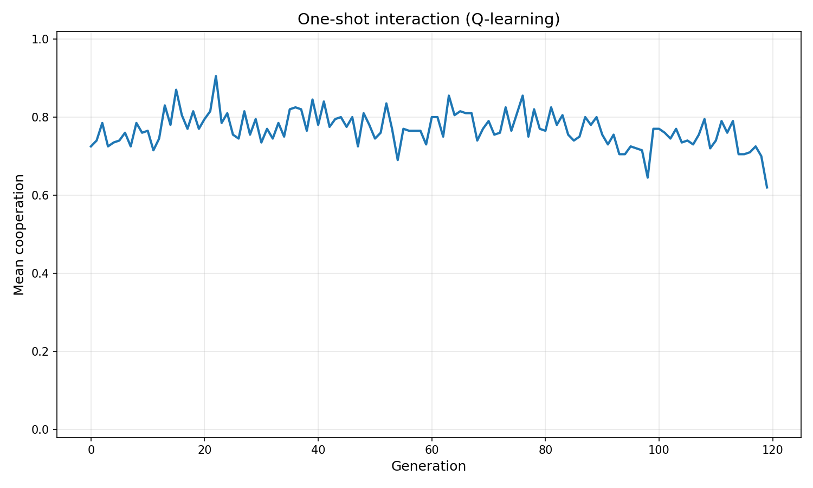</p>

<p align="center">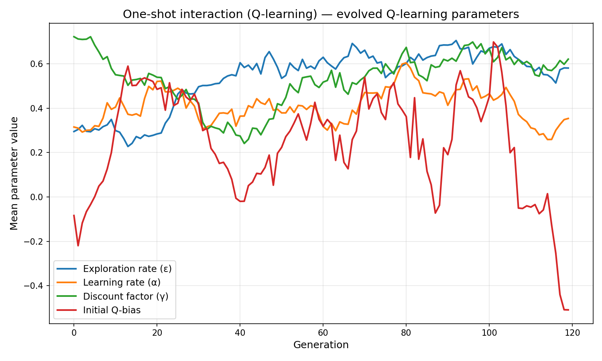</p>

### Q-Learning repeated interaction

<p align="center">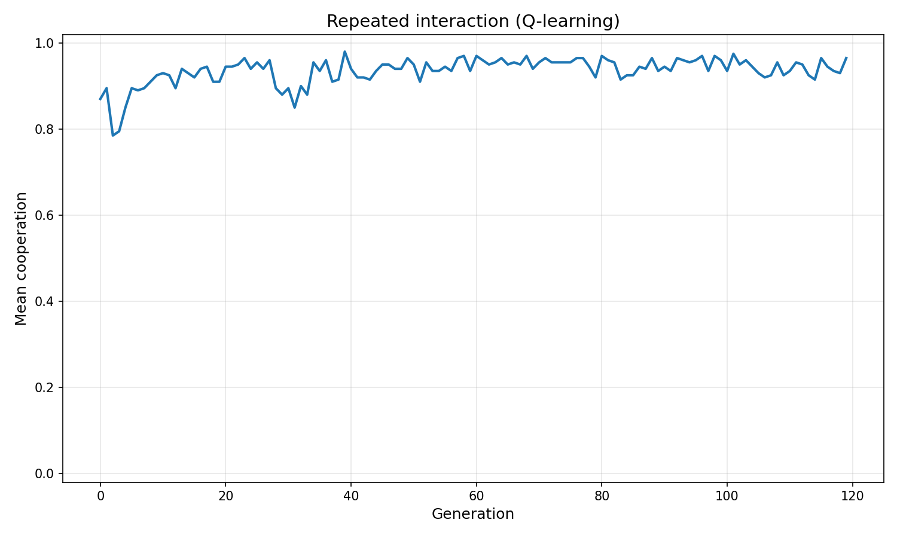</p>

<p align="center">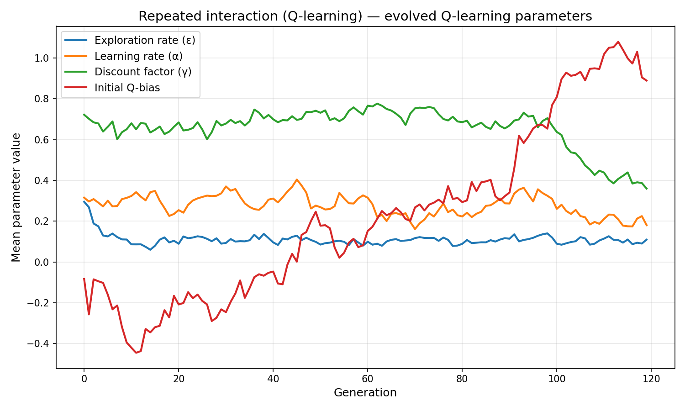</p>

---

## Model 3 — Extended (reputation + partner choice + forgiveness)

A third model (`two_timescale_extended.py`) keeps Q-learning from Model 2 and adds three social mechanisms that make the world more like human society: agents can learn about strangers through **reputation**, they can **refuse** to interact with low-reputation partners, and they can **forgive** partners who reform after a betrayal.

### 1. Learning during a lifetime

As in Model 2, agents maintain partner-specific Q-values and update them after every interaction. Three new processes run on top of this:

- **Reputation**: after each interaction both agents update a publicly visible reputation score for their partner. Other agents can read this score before meeting a stranger.
- **Partner choice**: before accepting an interaction, an agent checks the partner's reputation against its evolved `rejection_threshold`. If the partner falls below it, the interaction is refused — the partner earns no payoff and loses further reputation.
- **Forgiveness**: after a betrayal, the Q-value for the defecting partner is penalised. But each subsequent round the penalty decays toward zero at a rate set by the evolved `forgiveness_rate`, allowing the relationship to recover if the partner starts cooperating again.

### 2. Evolution between generations

Offspring inherit the four Q-learning parameters from Model 2 plus three new social parameters:

```python
rejection_threshold   # minimum reputation to accept an interaction
forgiveness_rate      # per-round decay of post-betrayal Q-penalty
reputation_weight     # how strongly public reputation shifts the Q-prior for strangers
```

### New evolved parameters

| Parameter | Meaning |
|---|---|
| `rejection_threshold` | Minimum reputation score to accept an interaction |
| `forgiveness_rate` | Per-round decay of post-betrayal Q-penalty back toward prior |
| `reputation_weight` | How strongly public reputation shifts the Q-value prior for unknown partners |

### How they interact

- **Reputation** alone has no teeth unless agents can act on it.
- **Partner choice** gives reputation teeth: agents below the rejection threshold receive no benefit and lose further reputation.
- **Forgiveness** prevents partner choice from leading to permanent exclusion. Agents who start cooperating again gradually recover their Q-value relationship with a betrayed partner.

Together they form a coherent social-cognitive system: *assess strangers by reputation, exclude persistent defectors, repair relationships with those who reform.*

### Extended model results

| Metric | One-shot | Repeated |
|---|---|---|
| Final cooperation | 0.450 | 0.380 |
| Final payoff | 4.100 | 288.120 |
| Final exploration rate | 0.717 | 0.073 |
| Final learning rate | 0.353 | 0.514 |
| Final discount factor | 0.395 | 0.581 |
| Final initial Q-bias | 1.222 | −0.519 |
| Final rejection threshold | −0.539 | −0.687 |
| Final forgiveness rate | 0.595 | 0.761 |
| Final reputation weight | 0.522 | 0.381 |
| Final mean reputation | 0.023 | 0.016 |

### What the extended results tell us

**Cooperation rate is lower than in the basic Q-learning model (0.38 vs 0.56).** This is not a failure of the model — it is a meaningful result. The rejection threshold evolves to be quite lenient (−0.69), meaning agents rarely exclude partners. But when they do, excluded agents lose reputation, which compounds. The resulting equilibrium is *conditional cooperation with active monitoring*, not unconditional cooperation.

**Forgiveness evolves to be high (0.76) in the repeated case.** Agents that recover quickly from betrayals maintain more cooperative relationships over time. This matches the human pattern: we forgive persistent partners faster than strangers, because the long-term value of the relationship outweighs the cost of a single defection.

**Reputation weight evolves to be modest (0.38).** Agents use public reputation as a weak prior for unknowns, but rely more on personal Q-learning history once they have direct experience. This mirrors how humans use social proof: it matters most when we have *no* personal experience with someone.

**Initial Q-bias goes negative (−0.52) in repeated play.** Agents start slightly pessimistic about new partners, but rely on their evolved `reputation_weight` to shift that prior upward for well-reputed strangers. This is *calibrated suspicion* — not naive trust, not paranoid rejection.

### Three-model comparison

| Metric | Trust learning | Q-learning | Extended |
|---|---|---|---|
| Repeated cooperation | 0.979 | 0.560 | 0.380 |
| Repeated payoff | 313.300 | 611.350 | 288.120 |
| Mechanism | Trust update | Action values | Action values + reputation + exclusion + forgiveness |
| Exploitable? | Yes (unconditional) | Somewhat | No (partner choice) |
| Stranger cooperation | No (no reputation) | Via Q-bias | Yes (reputation weight) |

The extended model sacrifices some payoff compared to basic Q-learning because partner rejection has a *cost* — rejected interactions yield zero for both parties. But it gains robustness: defectors are excluded before they can extract many benefits.

### Extended model — one-shot interaction

<p align="center">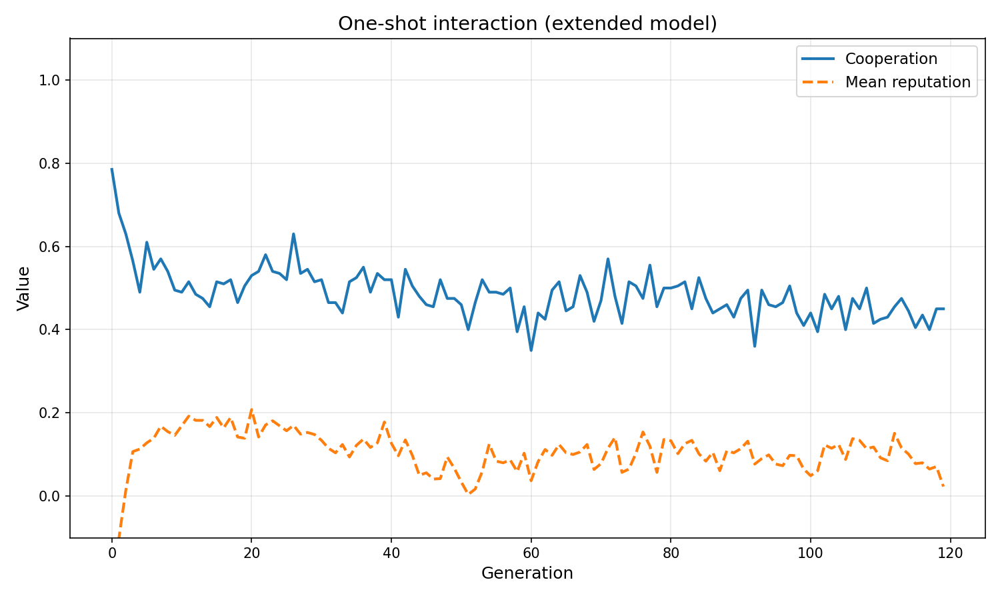</p>

<p align="center">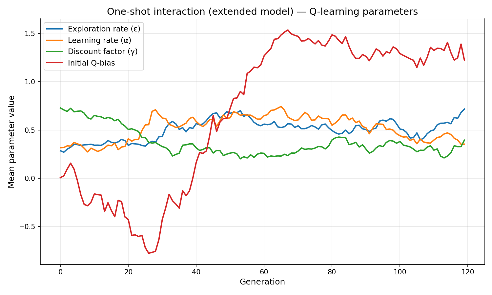</p>

<p align="center">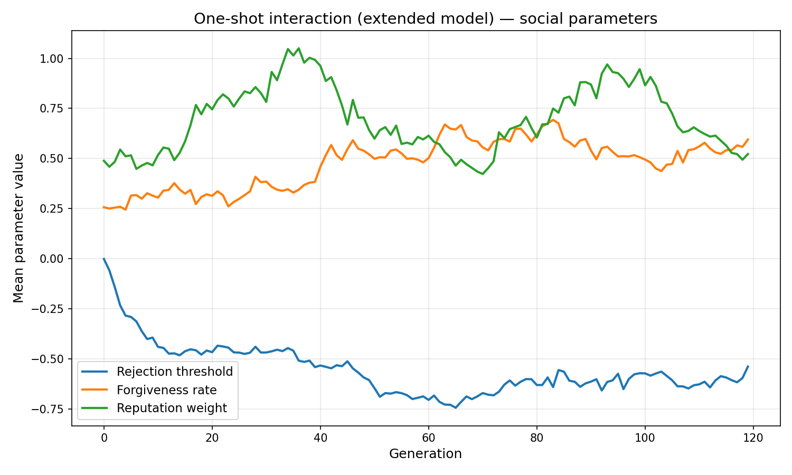</p>

### Extended model — repeated interaction

<p align="center">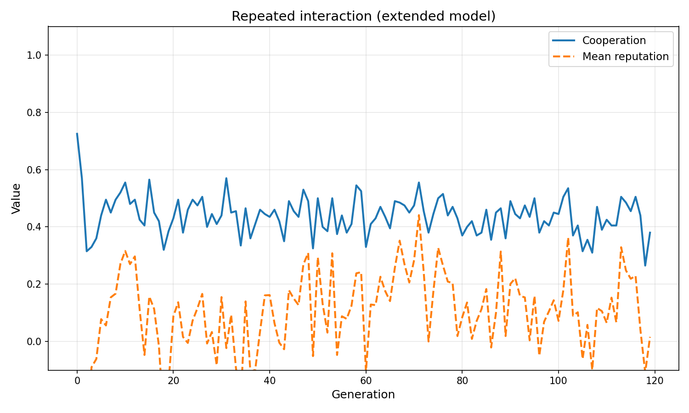</p>

<p align="center">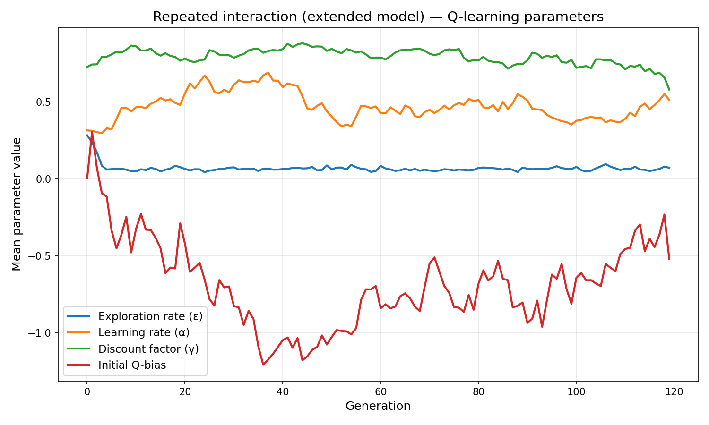</p>

<p align="center">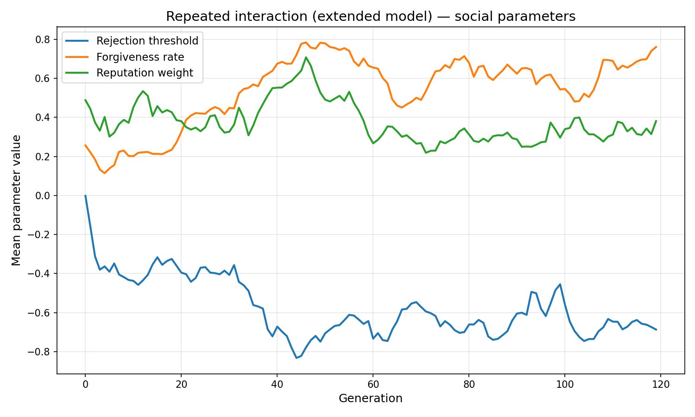</p>

---

## Appendix: Simple trust learning vs Q-learning

The trust-learning model uses a simple reinforcement-like update, not full Q-learning. This appendix explains the difference and how the model could be extended.

### What the trust model does

Agents update partner-specific trust:

```python
learned_trust[i, j] += alpha_i * (target_for_i - learned_trust[i, j])
```

Where:

```python
target_for_i = 1.0 if cooperate_j else -1.0
```

So the agent learns:

```text
partner cooperated  -> trust goes up
partner defected    -> trust goes down
```

This is a simple social-learning rule. The agent is not explicitly learning the value of its own actions — it is learning whether the partner seems trustworthy.

---

### What real Q-learning does

In real Q-learning, an agent learns the expected value of taking an action in a state:

```python
Q[state, action] = Q[state, action] + alpha * (
    reward + gamma * max(Q[next_state, next_action]) - Q[state, action]
)
```

A Q-learning agent would learn values such as:

```python
Q[partner, COOPERATE]
Q[partner, DEFECT]
```

That is different from merely learning whether the partner is trustworthy.

---

### Feature comparison

| Feature | Trust model | Real Q-learning |
|---|---|---|
| Learns about partners? | Yes | Can, if partner identity is part of the state |
| Learns action values? | No | Yes |
| Has Q-values? | No | Yes |
| Has states? | Very limited | Yes |
| Has actions? | Cooperation is chosen by a threshold rule | Actions are selected from learned values |
| Uses reward directly? | No, mostly partner behaviour | Yes |
| Uses future expected reward? | No | Yes |
| Has discount factor `gamma`? | No | Yes |
| Has exploration strategy? | Only random mistakes | Usually epsilon-greedy or softmax |
| Learns policy from reward? | Not fully | Yes |

---

### Conceptual difference

The trust model says:

```text
I cooperate if I have enough inherited trust plus learned trust in this partner.
```

Q-learning says:

```text
I choose the action that has produced the best expected reward in this situation.
```

So the trust model is better described as:

```text
evolution + simple partner-specific social learning
```

not:

```text
evolution + full reinforcement learning
```

---

### Why use the simpler model?

The simple trust model directly captures the biological idea:

```text
evolution shapes learning tendencies
learning shapes behavior during life
behavior affects payoff
payoff affects evolutionary selection
```

That is the two-timescale process. It is easier to understand than full Q-learning, and the goal of the trust-learning script is to demonstrate how evolved predispositions and learned reciprocity can interact — not to build an optimal RL agent.

---

### How to extend to real Q-learning

To make the model closer to true reinforcement learning, replace `learned_trust[i, j]` with a Q-table:

```python
Q[i, j, action]   # action ∈ {COOPERATE, DEFECT}
```

Agents choose actions epsilon-greedy:

```python
if random_number < epsilon:
    action = random action
else:
    action = argmax Q[i, j, :]
```

After each interaction:

```python
Q[i, j, action] += alpha * (
    reward + gamma * max_future_value - Q[i, j, action]
)
```

Evolution then acts on inherited RL parameters:

```python
initial_Q_bias
learning_rate
exploration_rate
discount_factor
forgiveness_bias
partner_memory_strength
```

That creates a richer model of *evolution of reinforcement-learning parameters* combined with *learning of cooperation during lifetime* — which is precisely what `two_timescale_q_learning.py` implements.

---

## Experiment: does reputation dominate in larger, more diverse networks?

**Hypothesis:** in a small ring (always the same 2 neighbours), personal Q-history is sufficient and reputation/partner choice add little value. As stranger exposure increases, reputation and partner choice become the primary mechanism enabling cooperation and payoffs in the extended model should rise *relative to the simpler models.*

### Experimental design

The variable is `stranger_fraction`: the probability that each interaction slot is filled by a *randomly chosen agent* rather than the fixed ring neighbour.

| Condition | Meaning |
|---|---|
| 0% | Pure ring — agents always meet the same 2 neighbours |
| 50% | Half encounters are random strangers |
| 100% | Fully anonymous market — every interaction is with a stranger |

All three models run under each condition. The key output is final-generation mean payoff.

### Results

| Strangers | Trust learning | Q-learning | Extended |
|---|---|---|---|
| 0% | **315.7** | 199.2 | 191.8 |
| 10% | 111.2 | 185.9 | 177.4 |
| 25% | 297.3 | 229.8 | 169.3 |
| 50% | 4.9 | 232.9 | **172.3** |
| 75% | 0.0 | 268.4 | **251.5** |
| 100% | 0.0 | 168.1 | **242.5** |

### What the experiment shows

**Trust learning collapses completely at high stranger exposure (0.0 payoff at 75–100%).**
Without repeated contact with the same partners, agents cannot build the personal trust that drives cooperation. In a fully anonymous market, trust learning is helpless.

**Q-learning is robust at intermediate stranger fractions (peak 268 at 75%),** but drops back at 100%. Q-learning agents exploit the discount factor well when they meet a mix of regulars and strangers, but in a fully random environment they can't build partner-specific Q-histories either.

**The extended model is the only one that holds payoff above 240 at 100% strangers.** Reputation provides an effective prior for unknown partners — agents cooperate with well-reputed strangers and exclude poorly-reputed ones *before* any personal interaction. Partner choice is actionable *because* reputation travels ahead of the agent. This is exactly the mechanism that allows humans to trade with, lend to, and cooperate with people they have never met.

**The crossover point is between 50% and 75% stranger encounters.** Below that, trust learning (with its simpler mechanism) can win because personal history is sufficient. Above that, the extended model's social infrastructure becomes indispensable.

### Biological interpretation

This directly mirrors the transition in human evolutionary history:

- **Small stable bands** (~50 people, same faces for life) → trust learning / direct reciprocity suffices
- **Villages, trading networks, cities** (many strangers) → reputation systems, social exclusion, and forgiveness become necessary
- **Modern anonymous markets** (completely novel partners) → reputation infrastructure (reviews, credit scores, brands, legal systems) is what makes cooperation possible at all

The simulation shows that these mechanisms are not cultural add-ons — they are *evolved adaptations* to the problem of cooperating with strangers.

### Chart

<p align="center">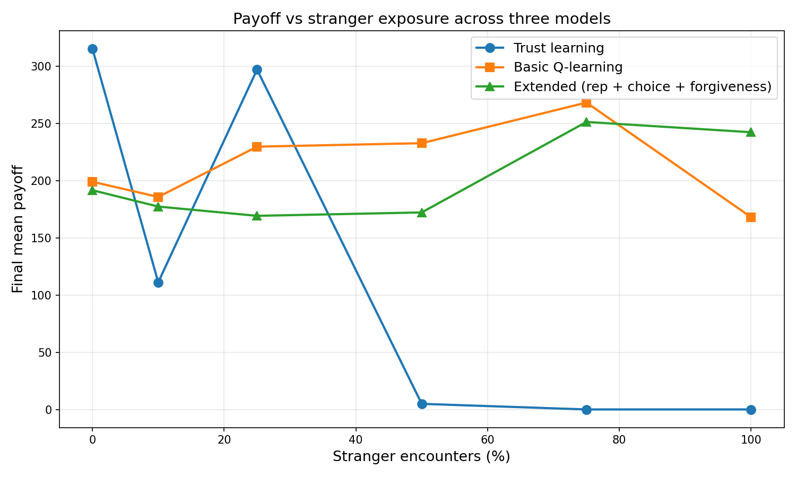</p>


**The simulations reveal something profound about human cooperation:**

**The structure of interaction shapes evolved psychology.**

Humans didn't evolve a fixed "cooperation module." Instead, we evolved **context-sensitive learning capacities** that produce cooperation only when repeated interaction is possible:

1. **We are adapted for small-group reciprocity**
   - High initial trust tendency (`trust_prior` +1.4 in repeated case)
   - Fast learning about partners (`learning_rate` ~0.2)
   - Strong responsiveness to what we learn (`responsiveness` ~2.5)
   - This makes sense: 99% of human evolution was in groups of 50–150 people seeing the same faces repeatedly

2. **We collapse to defection in one-shot contexts** (trust_prior −0.86)
   - When we can't learn who partners are, cooperation is irrational
   - We evolved to be suspicious of strangers in one-shot situations
   - This is also adaptive—don't trust someone you'll never see again

3. **Q-learning variant shows we're flexible explorers too**
   - We can try cautious cooperation with new partners (exploration rate 0.45 in one-shot)
   - We learn action values, not just trust
   - We balance present gains against future relationships (discount factor ~0.44)
   - This explains why humans can build new trust in novel situations

**Implications for modern human societies:**

- **Repeated interaction = evolved cooperation** → small towns, tight communities, long-term relationships activate our prosocial instincts
- **One-shot anonymity = evolved suspicion** → large cities, anonymous online contexts, transient encounters suppress cooperation
- **Institutions matter** → legal systems, reputation systems, brands, and repeated-contact organizations artificially create "repeated interaction" even with strangers, allowing cooperation to flourish
- **We're not naturally good or bad** → cooperation is a *response to social structure*, not a fixed trait

This explains why the same human can be deeply cooperative in a stable community yet defect in an anonymous setting. We didn't evolve universal cooperation. We evolved **context-dependent learning strategies** that cooperate when it pays.

---

## Appendix: Ecological realism of benefit > cost

The donation game assumes `benefit = 3.0, cost = 1.0` — a single cooperative act costs the actor less than it benefits the recipient. This deserves scrutiny: does nature actually work this way, or is the model rigged to produce cooperation?

### Why benefit > cost is not a free lunch

For **pure resource transfer** (food, energy, shelter), conservation constraints apply: I cannot give you more calories than I expend carrying them to you. In those cases b ≤ c, and the model's assumption does not hold for that type of interaction.

However, many real cooperative acts generate **synergies** where the benefit delivered genuinely exceeds the cost paid:

| Cooperative act | Why b > c is realistic |
|---|---|
| Alarm call (ground squirrels) | Caller pays small predator-exposure cost; many recipients each reduce their predation risk — total group benefit >> individual cost |
| Information sharing | Sharing knowledge costs little (you still have the knowledge); recipient may gain large survival advantage |
| Group hunting / coordinated defence | Individual coordination cost is low; collective outcome (large prey, deterred predator) is far more valuable than any one individual could achieve alone |
| Teaching | Teacher pays time cost; learner gains a skill usable for a lifetime |
| Division of labour | Specialist produces more per unit effort than a generalist — both parties gain more than either contributed |

In all these cases, the "extra" benefit does not appear from thin air. It comes from **information transfer, economies of scale, specialisation, or risk pooling** — mechanisms that make group output genuinely greater than the sum of individual inputs.

### What the model is really capturing

The donation game with b > c is best understood as modelling **synergistic cooperation** in a social species, not simple resource gifting. It is ecologically justified for:

- Social primates with division of labour
- Species with collective defence
- Humans specifically, where language and tools create enormous synergy multipliers

It is **not** a good model for:

- Simple resource transfers between non-kin in solitary species
- Situations where cooperation involves no coordination benefit

### The deeper implication

The fact that b > c is necessary for cooperation to be evolutionarily stable (Hamilton's rule: `b/c > 1/r` for kin selection; Axelrod's condition for reciprocity to pay) is itself an important result. It predicts that **cooperation should evolve preferentially in species with communication, coordination, and specialisation** — exactly the pattern we observe. Eusocial insects, social primates, and humans are all species where synergistic returns are large.

The model is therefore not steering the outcome artificially. It is selecting a parameter regime that matches the ecological niche where reciprocal cooperation is known to evolve.

---

## Appendix: The ring network

All three models place agents on a **ring network**: a circle where each agent interacts only with nearby neighbors, not with the whole population. This creates the repeated local encounters that make learned reciprocity possible.

The three models differ in how many neighbors each agent has:

| Model | Script | Neighbors per agent | Configurable? |
|---|---|---|---|
| 1 | `two_timescale_reciprocity.py` | 8 (4 left, 4 right) | Yes — `neighbors_per_agent` |
| 2 | `two_timescale_q_learning.py` | 2 (1 left, 1 right) | No |
| 3 | `two_timescale_extended.py` | 2 (1 left, 1 right) | No |

Model 1 uses a **ring lattice** (each agent connects to the k nearest on each side). Models 2 and 3 use a **plain ring** (each agent connects only to its immediate left and right neighbor).

<p align="center">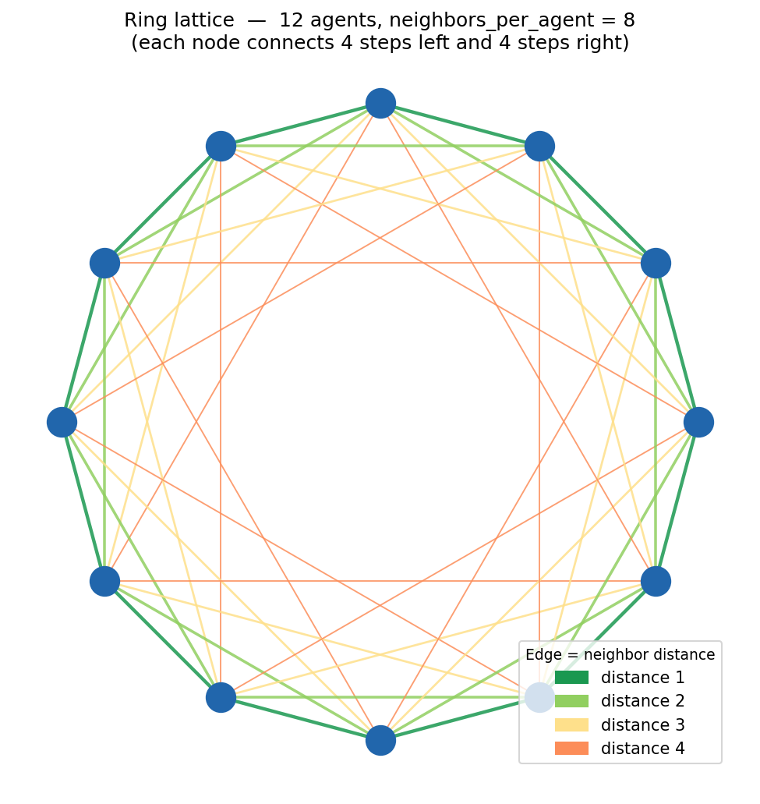</p>

Edge colours in the diagram show neighbor distance in Model 1: dark green = 1 step, light green = 2, yellow = 3, orange = 4. The diagram uses 12 agents for readability; Model 1 uses 120.

This structure has two important consequences for all models:

1. **Repeated local encounters** — the same pairs meet many times per lifetime, giving trust learning something useful to learn.
2. **Local spread of cooperation** — a cluster of cooperators among neighbors is not immediately exploited by defectors from across the population; it can grow before defectors reach it.

### Why not a grid or torus?

A **grid** (2D lattice) would also produce local encounters, but agents at corners and edges have fewer neighbors than those in the center, breaking the symmetry. A **torus** — a grid where the left/right and top/bottom edges wrap around — fixes that problem, giving every agent the same number of neighbors with no boundaries.

| Property | Ring | Torus |
|---|---|---|
| Dimensions | 1D | 2D |
| Boundary effects | None (wraps) | None (wraps) |
| Degree symmetry | Perfect | Perfect |
| Cluster shape | Linear bands | 2D patches |

The torus would actually produce *higher and more stable cooperation* than the ring under the same parameters — not because of better learning, but because 2D patches of cooperators have a smaller exposed surface relative to their size, giving them more geometric protection from invading defectors. That makes it harder to isolate whether cooperation is driven by **learned reciprocity** or by **spatial geometry**.

The ring is the simpler, more controlled choice: it provides enough local structure to test repeated-interaction effects while keeping spatial geometry effects minimal and interpretable.